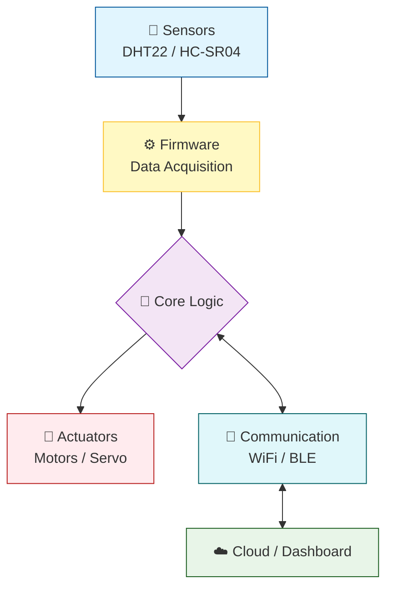

# pocket_memo
---
## 1. ABOUT THE PROJECT
## 2. BUILT WITH
## 3. SUPPORTED HARDWARE
## 4. ARCHITECTURE
## 5. INSTALLATION
## 6. COMPONENT DESCRIPTION
---
## BACKLOG
---
## LICENSE
## CONTACT

```mermaid
graph TD
    A[📡 Sensors<br>DHT22 / HC-SR04] --> B[⚙️ Firmware<br>Data Acquisition];
    B --> C{🧠 Core Logic};
    C --> D[🦾 Actuators<br>Motors / Servo];
    C <--> E[📶 Communication<br>WiFi / BLE];
    E <--> F[☁️ Cloud / Dashboard];

    style A fill:#e1f5fe,stroke:#01579b
    style B fill:#fff9c4,stroke:#fbc02d
    style C fill:#f3e5f5,stroke:#7b1fa2
    style D fill:#ffebee,stroke:#b71c1c
    style E fill:#e0f7fa,stroke:#006064
    style F fill:#e8f5e8,stroke:#1b5e20
```
